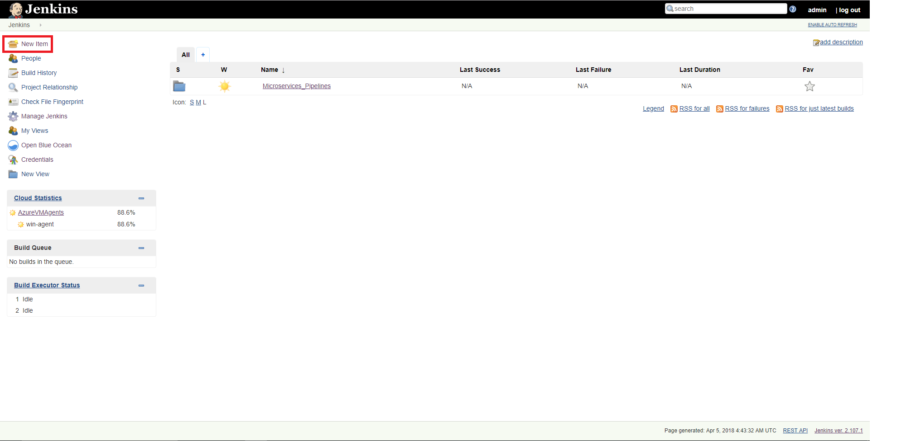
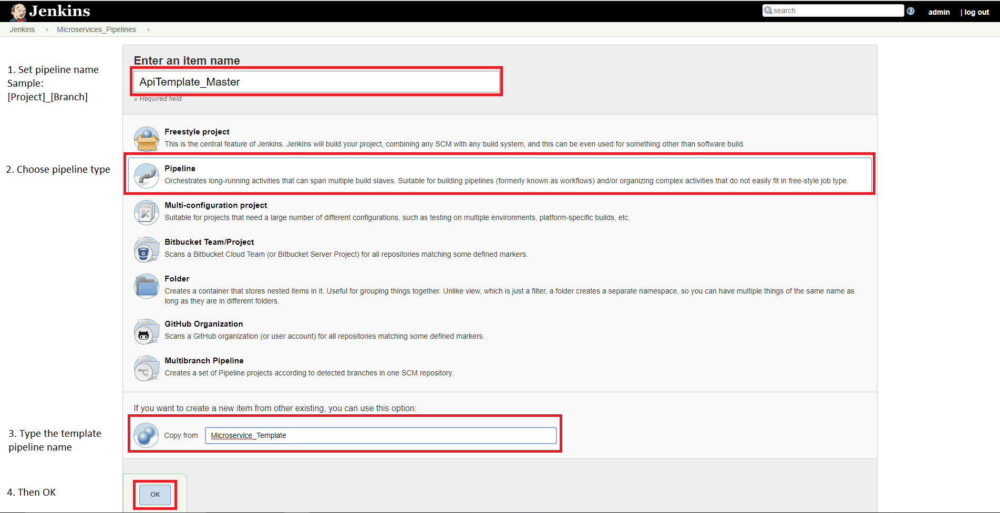
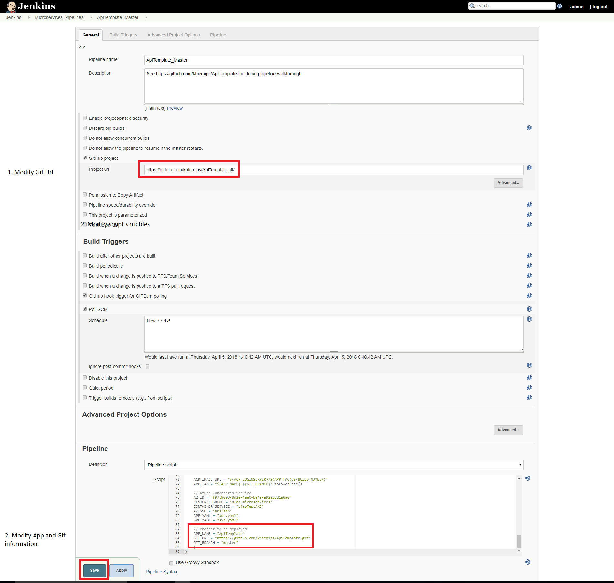
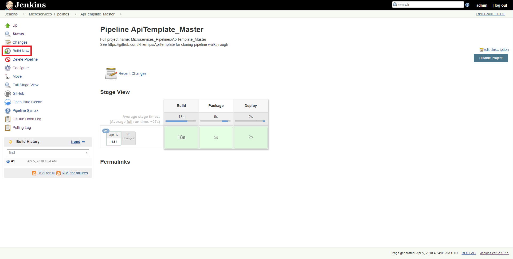
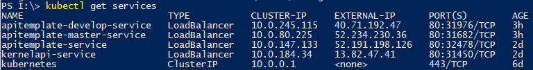

## Create api
 - Create a new api inherit from _ApiBaseController<{YourEntity}>_ .  Now you have a api with CRUD :)
 - The entities are located in "Entity" project. In case you wanna add a new entity, it must be inherited from _EntityBase_ class.
 - If you need to extend the api for other business, just create the sevices then inject them into api contractor.

## Create OData api
 - The same as creating api, just inherit from _ODataBaseController<{YourEntity}>_ :)  

 ## Create Jenkins pipeline
 

## Verify Kubernetes deployment

1. Login to Azure CLI

`az login`

2. Set active subscription

`az account set --subscription [SUBSCRIPTION_GUID]`

3. Set active Kubernetes cluster

`az aks get-credentials --resource-group [RESOURCE_GROUP_NAME] --name "CLUSTER_NAME"`

4. List all services

`kubectl get services`

Then you can fine your project named like `[project]-[branch]-service`.

5. (Optional) Go to Kubernetes dashboard

`kubectl proxy --port PORT_NUMBER`

Then proceed to the dashboard via the below link
`http://127.0.0.1:PORT_NUMBER/api/v1/namespaces/kube-system/services/kubernetes-dashboard/proxy/#!/overview?namespace=default`

